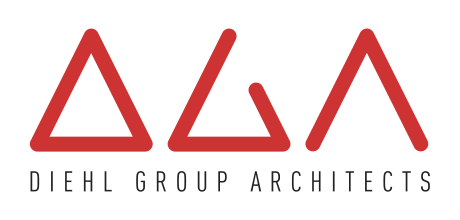

# Little Hammer Labs, LLC


## About Us

**Little Hammer Labs** is a specialized software development company that crafts innovative software solutions for businesses. We focus on custom development, digital transformation, and software engineering excellence.

## Our Services

- **Custom Software Development** - Tailored solutions for your business needs
- **Digital Transformation** - Modernizing legacy systems and processes
- **Software Consulting** - Expert guidance on technology decisions
- **Software Engineering** - High-quality, scalable code development

## Our Customers

We're proud to work with industry leaders including:

### Diehl Group Architects


[Visit Diehl Group Architects](https://www.diehlgroup.com/) - A premier architectural firm that trusts us with their software solutions.

## Contact Information

**Get in Touch with Us:**

📧 **Email:** [contact@littlehammerlabs.com](mailto:contact@littlehammerlabs.com)

## Company Details

- **Company Type:** Limited Liability Company (LLC)
- **Industry:** Software Development & Technology Consulting
- **Specialization:** Custom Software Solutions & Digital Transformation

## Website

Visit our website: [https://littlehammerlabs.github.io](https://littlehammerlabs.github.io)

## Technology Stack

Our website is built with modern web technologies:
- **HTML5** - Semantic markup for accessibility
- **CSS3** - Responsive design with modern features
- **Performance Optimized** - Optimized for GitHub Pages hosting

## Performance Features

- ✅ **Separated CSS** for better caching
- ✅ **Preloaded resources** for faster loading
- ✅ **Responsive design** for all devices
- ✅ **SEO optimized** with comprehensive metadata
- ✅ **Structured data** for search engines
- ✅ **Optimized images** with lazy loading

## Repository Structure

```
Little-Hammer-Labs.github.io/
├── index.html          # Main website page
├── styles.css          # Optimized CSS styles
├── lhlfull.png         # Company logo
├── dgalogo.png         # Customer logo
├── CNAME               # Custom domain configuration
└── README.md           # This file
```

## GitHub Pages

This repository is configured to host our company website on GitHub Pages, providing:
- **Fast global CDN** delivery
- **Automatic HTTPS** security
- **Reliable hosting** with 99.9% uptime
- **Easy deployment** from our main branch

## Local Development

To run this website locally:

1. Clone the repository
2. Open `index.html` in your web browser
3. Or use a local server: `python -m http.server 8000`

## Contributing

This is our company website repository. For business inquiries, please contact us at [contact@littlehammerlabs.com](mailto:contact@littlehammerlabs.com).

## License

© 2025 Little Hammer Labs, LLC. All rights reserved.

---

*Building the future, one line of code at a time.* 🔨💻
